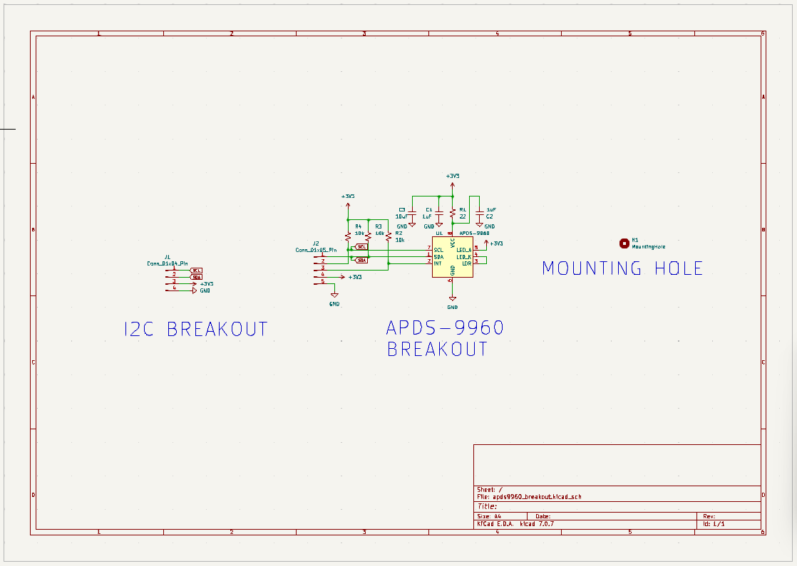
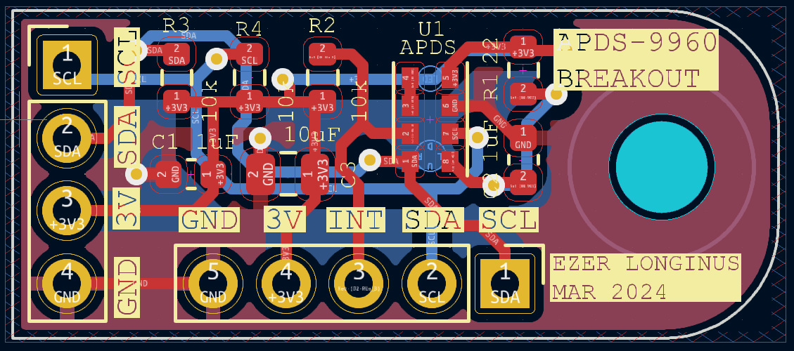

# APDS9960_Breakout
Breakout for APD29960 Gesture/Prox/Light Sensor.

## Purpose
I had a bunch of these little sensors from an earlier client project.  The project ended up not needed these, and I became the proud owner of a bunch of loose components.  I finally got around to making a simple breakout board for them (It assumes a 3V power source and has no voltage protection of any sort).  
The I2C layout is identical to the OLED boards that I also have a bunch of (and being utilized in the ATTiny412 Metronome project).  The idea being that I could repurpose a metronome board and just plug this in to quickly play with. 

## Scematic

## Layout

## TO DO:
* Populate & test board when it arrives
* Push some test code with the ATTiny412
* Post pictures of finished board